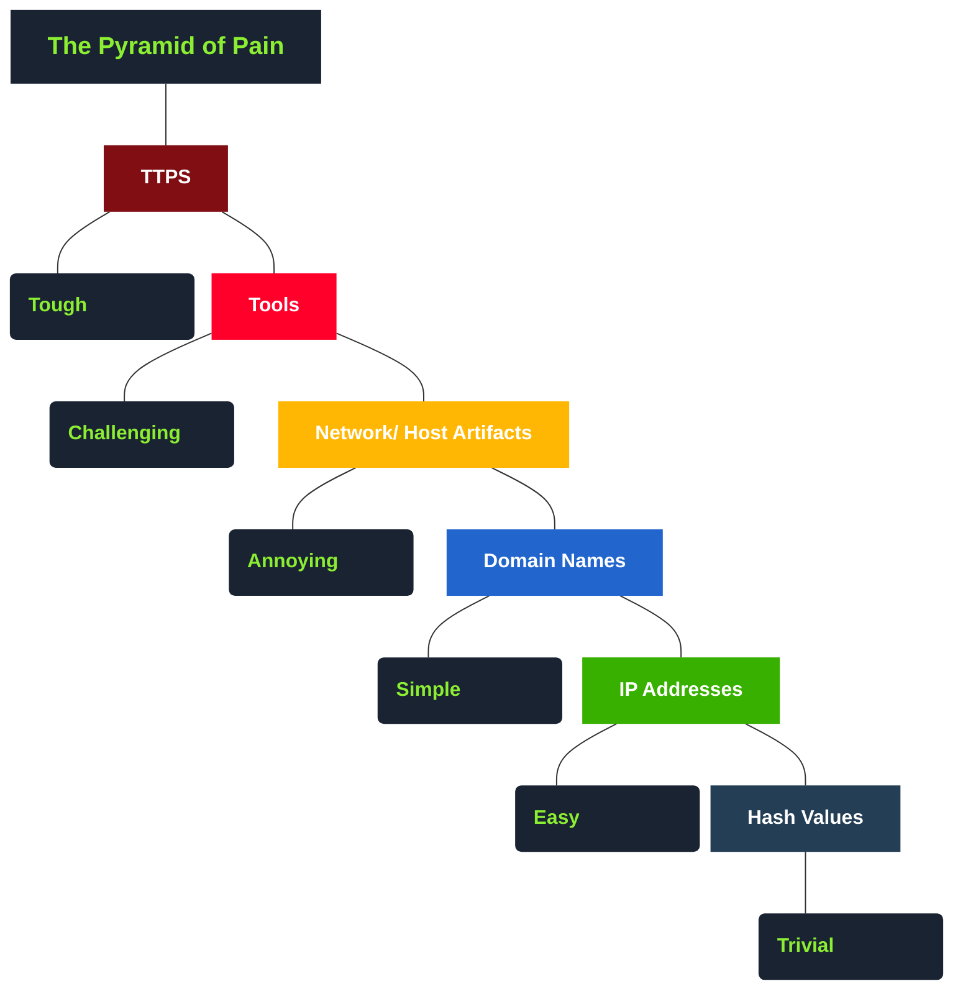

# INTRODUCTION
Pyramid of pain est un concept reconnu est appliqué aux solutions de cybersécurité telles que Cisco Security, SentinelOne et SOCRadar afin d'améliorer l'efficacité du renseignement sur les cybermenaces (CTI), de la chasse aux menaces et des exercices de réponse aux incidents.
Il est important pour un chasseur de menaces, un intervenant ou un analyste SOC de comprendre le concept de la Pyramide de la Douleur.

## hash value 
As per Microsoft, the hash value is a numeric value of a fixed length that uniquely identifies data. A hash value is the result of a hashing algorithm. The following are some of the most common hashing algorithms: 

MD5 (Message Digest, defined by RFC 1321(opens in new tab)) - was designed by Ron Rivest in 1992 and is a widely used cryptographic hash function with a 128-bit hash value. MD5 hashes are NOT considered cryptographically secure. In 2011, the IETF published RFC 6151, "Updated Security Considerations for the MD5 Message-Digest and the HMAC-MD5 Algorithms(opens in new tab)," which mentioned a number of attacks against MD5 hashes, including the hash collision.
SHA-1 (Secure Hash Algorithm 1, defined by RFC 3174(opens in new tab)- was invented by United States National Security Agency in 1995. When data is fed to SHA-1 Hashing Algorithm, SHA-1 takes an input and produces a 160-bit hash value string as a 40 digit hexadecimal number. NIST deprecated the use of SHA-1 in 2011(opens in new tab) and banned its use for digital signatures at the end of 2013 based on it being susceptible to brute-force attacks. Instead, NIST recommends migrating from SHA-1 to stronger hash algorithms in the SHA-2 and SHA-3 families.
The SHA-2 (Secure Hash Algorithm 2) - SHA-2 Hashing Algorithm was designed by The National Institute of Standards and Technology (NIST) and the National Security Agency (NSA) in 2001 to replace SHA-1. SHA-2 has many variants, and arguably the most common is SHA-256. The SHA-256 algorithm returns a hash value of 256-bits as a 64 digit hexadecimal number.
A hash is not considered to be cryptographically secure if two files have the same hash value or digest.

Security professionals usually use the hash values to gain insight into a specific malware sample, a malicious or a suspicious file, and as a way to uniquely identify and reference the malicious artifact.

You've probably read ransomware reports in the past, where security researchers would provide the hashes related to the malicious or suspicious files used at the end of the report. You can check out The DFIR Report(opens in new tab) and Trellix Threat Research Blogs(opens in new tab) if you’re interested in seeing an example.

Various online tools can be used to do hash lookups like VirusTotal(opens in new tab) and Metadefender Cloud - OPSWAT(opens in new tab).

However, as an attacker, modifying a file by even a single bit is trivial, which would produce a different hash value. With so many variations and instances of known malware or ransomware, threat hunting using file hashes as the IOC (Indicators of Compromise) can become difficult.

Let’s take a look at an example of how you can change the hash value of a file by simply appending a string to the end of a file using echo: File Hash (Before Modification)
 
## IP Address (Easy)

You may have learned the importance of an IP Address from the "What is Networking?" Room. An IP address is used to identify any device connected to a network. These devices range from desktops, to servers and even CCTV cameras! We rely on IP addresses to send and receive the information over the network. But we are not going to get into the structure and functionality of the IP address. As a part of the Pyramid of Pain, we’ll evaluate how IP addresses are used as an indicator.

In the Pyramid of Pain, IP addresses are indicated with the color green. You might be asking why and what you can associate the green colour with?

From a defense standpoint, knowledge of the IP addresses an adversary uses can be valuable. A common defense tactic is to block, drop, or deny inbound requests from IP addresses on your parameter or external firewall. This tactic is often not bulletproof as it’s trivial for an experienced adversary to recover simply by using a new public IP address.

Malicious IP connections (app.any.run(opens in new tab)):
NOTE! Do not attempt to interact with the IP addresses shown above.

One of the ways an adversary can make it challenging to successfully carry out IP blocking is by using Fast Flux.

According to Akamai(opens in new tab), Fast Flux is a DNS technique used by botnets to hide phishing, web proxying, malware delivery, and malware communication activities behind compromised hosts acting as proxies. The purpose of using the Fast Flux network is to make the communication between malware and its command and control server (C&C) challenging to be discovered by security professionals. 

So, the primary concept of a Fast Flux network is having multiple IP addresses associated with a domain name, which is constantly changing. Palo Alto created a great fictional scenario to explain Fast Flux: "(opens in new tab)Fast Flux 101: How Cybercriminals Improve the Resilience of Their Infrastructure to Evade Detection and Law Enforcement Takedowns"(opens in new tab)

Read the following report (generated from any.run(opens in new tab)) for this sample here to answer the questions below:

## Domain Names (Simple)
Let's step up the Pyramid of Pain and move on to Domain Names. You can see the transition of colors - from green to teal.

Domain Names can be thought as simply mapping an IP address to a string of text. A domain name can contain a domain and a top-level domain (e.g. evilcorp.com ) or a sub-domain followed by a domain and top-level domain (e.g. tryhackme.evilcorp.com ). But we will not go into the details of how the Domain Name System (DNS) works. You can learn more about DNS in this "DNS in Detail" Room . 

Domain Names can be a little more of a pain for the attacker to change as they would most likely need to purchase the domain, register it and modify DNS records. Unfortunately for defenders, many DNS providers have loose standards and provide APIs to make it even easier for the attacker to change the domain.

What you saw in the URL above is  adıdas.de  which has the Punycode of  http://xn--addas-o4a.de/

Internet Explorer, Google Chrome, Microsoft Edge, and Apple Safari are now pretty good at translating the obfuscated characters into the full Punycode domain name.
 
To detect malicious domains, proxy logs or web server logs can be used.
 
Attackers usually hide the malicious domains under URL shorteners.   A URL Shortener is a tool that creates a short and unique URL that will redirect to the specific website specified during the initial step of setting up the URL Shortener link. The attackers normally use the following URL-shortening services to generate malicious links: 
 
bit.ly
goo.gl
ow.ly
s.id
smarturl.it
tiny.pl
tinyurl.com
x.co
You can see the actual website the shortened link is redirecting you to by appending "+" to it (see the examples below). Type the shortened URL in the address bar of the web browser and add the above characters to see the redirect URL. 
Viewing Connections in Any.run:

 

Because Any.run is a sandboxing service that executes the sample, we can review any connections such as HTTP requests, DNS requests or processes communicating with an IP address. To do so, we can look at the "networking" tab located just below the snapshot of the machine.

Please note : you should be extremely cautious about visiting any of the IP addresses or HTTP requests made in a report. After all, these are behaviours from the malware sample - so they're probably doing something dangerous!

 

HTTP Requests:

This tab shows the recorded HTTP requests since the detonation of the sample. This can be useful to see what resources are being retrieved from a webserver, such as a dropper or a callback.

Connections:

This tab shows any communications made since the detonation of the sample. This can be useful to see if a process communicates with another host. For example, this could be C2 traffic, uploading/downloading files over FTP, etc.

DNS Requests:

This tab shows the DNS requests made since the detonation of the sample. Malware often makes DNS requests to check for internet connectivity (I.e. if It can't reach the internet/call home, then it's probably being sandboxed or is useless). 

## Host Artifacts (Annoying)

Let's take another step up to the yellow zone.

On this level, the attacker will feel a little more annoyed and frustrated if you can detect the attack. The attacker would need to circle back at this detection level and change his attack tools and methodologies. This is very time-consuming for the attacker, and probably, he will need to spend more resources on his adversary tools.

Host artifacts are the traces or observables that attackers leave on the system, such as registry values, suspicious process execution, attack patterns or IOCs (Indicators of Compromise), files dropped by malicious applications, or anything exclusive to the current threat.

## Network Artifacts (Annoying)
Network Artifacts also belong to the yellow zone in the Pyramid of Pain. This means if you can detect and respond to the threat, the attacker would need more time to go back and change his tactics or modify the tools, which gives you more time to respond and detect the upcoming threats or remediate the existing ones.

A network artifact can be a user-agent string, C2 information, or URI patterns followed by the HTTP POST requests.An attacker might use a User-Agent string that hasn’t been observed in your environment before or seems out of the ordinary. The User-Agent is defined by RFC2616(opens in new tab) as the request-header field that contains the information about the user agent originating the request.

Network artifacts can be detected in PCAPs (file that contains the network packet dumps) by using a tool such as Wireshark or TShark, or exploring IDS (Intrusion Detection System) alerts from a tool such as Snort(opens in new tab). You will learn these tools in the following rooms, but in short, imagine a list of suspicious HTTP POST requests:
It's hard to attribute the requests to a specific malware from the first glance, but you can dig deeper and look for its network indicators, such as the User-Agent. In TShark, you could use the following command:

tshark --Y http.request -T fields -e http.host -e http.user_agent -r analysis_file.pcap 
These are the most common User-Agent strings found for the Emotet(opens in new tab) trojan. If you can detect the custom User-Agent strings that the attacker is using, you might be able to block them, creating more obstacles and making their attempt to compromise the network more annoying.

