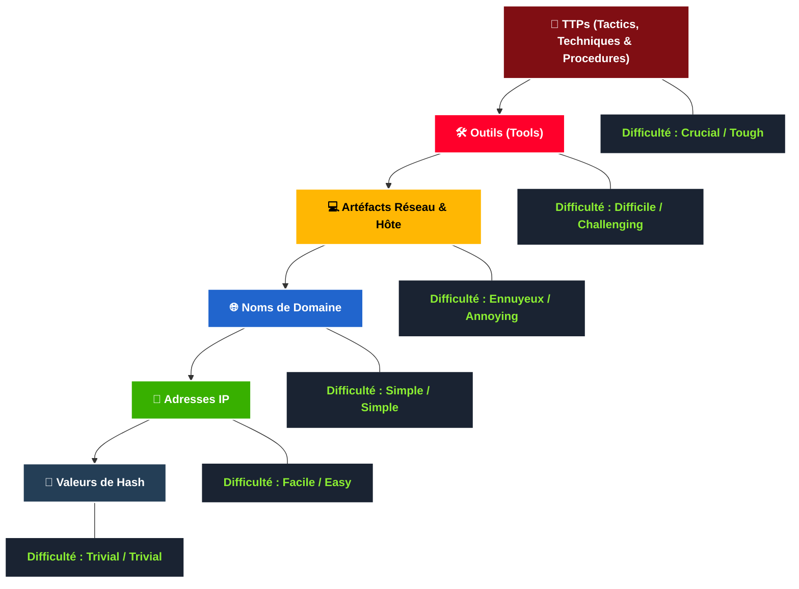

 

## INTRODUCTION

La **Pyramid of Pain** (Pyramide de la Douleur) est un concept conceptuel reconnu et appliqué au sein des solutions de cybersécurité (telles que Cisco Security, SentinelOne et SOCRadar) pour améliorer l'efficacité du renseignement sur les cybermenaces (**CTI - Cyber Threat Intelligence**), de la chasse aux menaces (*Threat Hunting*) et des opérations de réponse aux incidents.

Pour un chasseur de menaces, un analyste SOC ou un intervenant en cas d'incident, la maîtrise de ce concept est fondamentale pour évaluer l'impact de leurs mécanismes de détection sur l'adversaire.



---

## Valeurs de Hash (Trivial)

Selon Microsoft, une valeur de hash (ou empreinte numérique) est une valeur numérique de longueur fixe qui identifie de manière unique une donnée. Elle est le résultat d'un algorithme de hachage. Voici les algorithmes les plus courants :

* **MD5 (Message Digest 5, défini par l'RFC 1321) :** Conçu par Ron Rivest en 1992, c'est une fonction de hachage cryptographique de 128 bits largement utilisée. **Le MD5 n'est plus considéré comme sécurisé.** En 2011, l'IETF a publié l'RFC 6151, signalant plusieurs attaques contre MD5, notamment les **collisions de hash** (deux fichiers distincts générant la même empreinte).
* **SHA-1 (Secure Hash Algorithm 1, défini par l'RFC 3174) :** Développé par la NSA en 1995. Il produit une empreinte de 160 bits (représentée par une chaîne hexadécimale de 40 caractères). Le NIST a déprécié le SHA-1 en 2011 et interdit son utilisation pour les signatures numériques fin 2013 en raison de sa vulnérabilité aux attaques par force brute. Le NIST recommande de migrer vers les familles SHA-2 et SHA-3.
* **SHA-2 (Secure Hash Algorithm 2) :** Conçu par le NIST et la NSA en 2001 pour remplacer le SHA-1. Il possède plusieurs variantes, la plus courante étant le **SHA-256**, qui renvoie une valeur de 256 bits (64 caractères hexadécimaux).

> **Règle de sécurité :** Un algorithme de hachage n'est plus considéré comme cryptographiquement sûr si deux fichiers différents peuvent produire la même valeur de hash (collision).

### Utilisation opérationnelle

Les professionnels de la sécurité utilisent les hashes pour identifier de manière unique un échantillon de malware ou un fichier suspect. Dans les rapports de menaces (comme ceux de *The DFIR Report* ou *Trellix Threat Research*), les indicateurs de compromission (IoC) de type hash sont systématiquement fournis en fin de document. Des outils en ligne comme **VirusTotal** ou **Metadefender Cloud (OPSWAT)** permettent d'effectuer des recherches rapides basées sur ces hashes.

### Pourquoi est-ce "Trivial" ?

Pour un attaquant, modifier un fichier (ne serait-ce qu'en modifiant un seul bit ou en ajoutant un caractère via une commande comme `echo`) suffit à modifier totalement la valeur du hash. Par conséquent, se baser uniquement sur les hashes de fichiers comme indicateurs de compromission (IoC) rend la chasse aux menaces très difficile face au polymorphisme des malwares.

---

## Adresses IP (Facile)

Une adresse IP sert à identifier tout appareil connecté à un réseau (ordinateurs, serveurs, caméras IP). En sécurité défensive, connaître les adresses IP utilisées par un adversaire est utile, mais leur blocage (via un pare-feu périmétrique) constitue une défense fragile.

### Pourquoi est-ce "Facile" ?

Il est extrêmement simple pour un attaquant expérimenté de contourner un blocage IP en obtenant une nouvelle adresse IP publique (via des proxys, VPN, ou infrastructures cloud éphémères).

### La technique du Fast Flux

Pour complexifier le blocage d'IP, les attaquants utilisent le **Fast Flux**. Selon Akamai, il s'agit d'une technique DNS utilisée par les botnets pour masquer les activités de phishing, de livraison de malwares ou de communication de serveurs de commande et contrôle (**C2**) derrière un réseau changeant d'hôtes compromis agissant comme proxys. Le concept de base consiste à associer une multitude d'adresses IP à un seul nom de domaine, ces adresses changeant en continu à des fréquences très élevées.

---

## Noms de Domaine (Simple)

Un nom de domaine associe une adresse IP à une chaîne de caractères textuelle (ex: `evilcorp.com` ou le sous-domaine `tryhackme.evilcorp.com`).

### Pourquoi est-ce "Simple" ?

Changer de nom de domaine est légèrement plus contraignant pour un attaquant que de changer d'adresse IP : il doit acheter le domaine, l'enregistrer et modifier les enregistrements DNS. Cependant, de nombreux bureaux d'enregistrement (*registrars*) ont des critères de vérification souples et fournissent des API qui automatisent et facilitent ces modifications pour les cybercriminels.

### Obscurcissement et détection

Les attaquants utilisent parfois des caractères homoglyphes (attaques par IDN homographe). Par exemple, le faux domaine `adıdas.de` se traduit techniquement en Punycode par `http://xn--addas-o4a.de/`. Les navigateurs modernes (Chrome, Edge, Safari) sont aujourd'hui performants pour traduire et afficher ces caractères obscurcis afin d'alerte l'utilisateur.

Pour détecter les domaines malveillants, l'analyse des **logs de proxys** ou des **serveurs web** est indispensable.

### Raccourcisseurs d'URL

Les attaquants masquent souvent leurs domaines malveillants derrière des services de réduction d'URL pour duper les utilisateurs (ex: `bit.ly`, `goo.gl`, `ow.ly`, `s.id`, `tinyurl.com`).
*Astuce de sécurité :* Sur la plupart de ces plateformes, ajouter le caractère `+` à la fin de l'URL raccourcie dans votre navigateur permet de visualiser la page de statistiques et l'URL de redirection réelle sans exécuter le lien.

### Analyse des connexions dans Any.run (Sandbox)

Lors de l'analyse d'un malware dans un environnement sécurisé (*sandbox*), l'onglet "Networking" permet d'isoler plusieurs types de requêtes :

* **Requêtes HTTP :** Utiles pour voir quelles ressources (comme un outil de téléchargement ou *dropper*) sont récupérées depuis un serveur web.
* **Connections :** Montre toutes les communications réseau établies (flux C2, exfiltration FTP, etc.).
* **Requêtes DNS :** Identifie les résolutions de noms. Les malwares effectuent souvent des requêtes DNS initiales pour tester leur connectivité Internet avant de s'activer.

---

## Artéfacts Hôte (Ennuyeux / Annoying)

À ce niveau de la pyramide, si vos capacités de détection forcent l'attaquant à modifier ses artéfacts, vous commencez à l'épuiser. Il doit alors revoir ses outils et ses méthodologies, ce qui consomme du temps et des ressources.

Les **artéfacts hôtes** sont les traces laissées par l'attaquant directement sur le système d'exploitation compromis :

* Clés et valeurs de registre modifiées ou créées.
* Traces d'exécution de processus suspects.
* Fichiers déposés (*dropped*) par les applications malveillantes.
* Modèles d'attaque comportementaux propres à la menace sur la machine.

---

## Artéfacts Réseau (Ennuyeux / Annoying)

Tout comme les artéfacts hôtes, les artéfacts réseau appartiennent à la zone jaune. Détecter ces éléments donne aux défenseurs un avantage temporel crucial pour remédier aux vulnérabilités avant que l'attaquant ne s'adapte.

Un **artéfact réseau** peut être :

* Une chaîne de caractères **User-Agent** spécifique ou inhabituelle.
* La structure et le contenu des requêtes vers le serveur C2.
* Des motifs d'URI récurrents lors de requêtes HTTP POST.

### Détection pratique

Ces artéfacts se détectent dans les captures de paquets (fichiers PCAP) via des outils comme **Wireshark** ou **TShark**, ou via des alertes d'IDS (Systèmes de Détection d'Intrusions) comme **Snort**.

Exemple de commande TShark pour extraire les User-Agents et les hôtes visés :

```bash
tshark -Y http.request -T fields -e http.host -e http.user_agent -r fichier_analyse.pcap

```

*Note :* Le cheval de Troie *Emotet* est historiquement connu pour utiliser des chaînes User-Agent personnalisées très spécifiques. Les identifier permet de bloquer l'attaque au niveau du flux HTTP.

---

## Outils (Difficile / Challenging)

À ce stade, l'attaquant utilise des logiciels spécifiques pour mener ses actions : utilitaires de création de documents macro malveillants (*maldocs*) pour le spearphishing, portes dérobées (*backdoors*) pour établir l'infrastructure C2, fichiers `.exe` ou `.dll` personnalisés, charges utiles (*payloads*) ou casseurs de mots de passe.

### Vos armes défensives

* **Signatures Antivirus & Règles YARA :** Essentielles pour identifier les fichiers d'outils connus. Des plateformes comme *MalwareBazaar* et *Malshare* fournissent des échantillons et des flux de règles YARA.
* **Règles de détection comportementales :** Le site *SOC Prime Threat Detection Marketplace* permet aux professionnels de partager des règles de détection indexées sur les dernières vulnérabilités (CVE).
* **Hachage Flou (Fuzzy Hashing) :** Contrairement au hachage traditionnel, le hachage flou (comme l'outil **SSDeep**) permet d'effectuer des analyses de similarité. Il peut associer deux fichiers distincts si ces derniers partagent une grande partie de leur code, même si l'attaquant a modifié quelques variables pour contourner les signatures classiques.

---

## TTPs - Tactiques, Techniques & Procédures (Crucial / Tough)

Nous atteignons ici le sommet de la Pyramide de la Douleur.

Les **TTPs** englobent l'ensemble de la matrice **MITRE ATT&CK**. Cela représente la méthodologie globale de l'adversaire pour atteindre son objectif, depuis l'accès initial (phishing) jusqu'à la persistance et l'exfiltration des données.

Si vous êtes capable de détecter et de bloquer les TTPs de l'attaquant, vous ne lui laissez presque aucune chance de réagir.

### Exemple concret

Si vous détectez une attaque de type *Pass-the-Hash* grâce à la surveillance des journaux d'événements Windows (*Windows Event Logs*) et que vous la bloquez, vous neutralisez immédiatement sa capacité de déplacement latéral au sein de votre réseau.

À ce niveau de blocage, l'attaquant n'a plus que deux options :

1. Faire marche arrière, investir du temps et de l'argent dans la recherche, le développement et l'entraînement pour concevoir une approche totalement nouvelle.
2. Abandonner et cibler une autre organisation moins bien protégée.

L'option 2 est, de loin, la moins coûteuse pour lui, ce qui valide l'efficacité ultime d'une défense basée sur le sommet de la pyramide.


