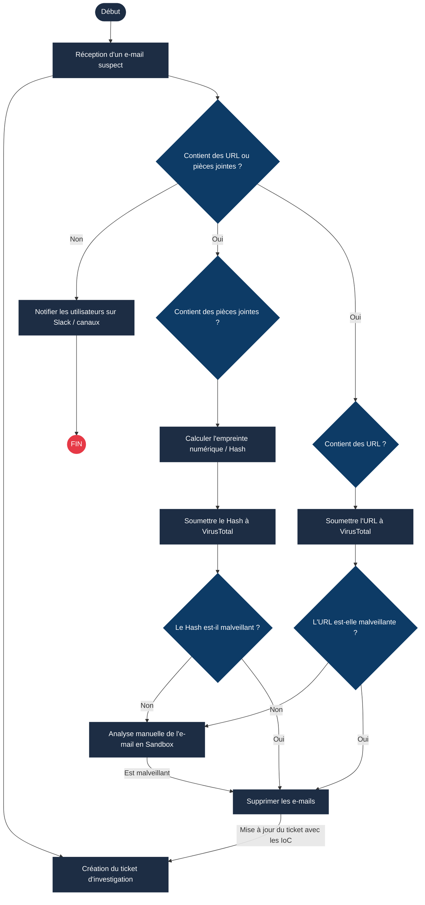

# INTRODUCTION

Pour se défendre contre les attaques, une équipe SOC s'appuie sur diverses solutions de sécurité telles que les SIEM, les EDR, les pare-feux et les plateformes de Threat Intelligence (renseignement sur les cybermenaces). Elle doit également communiquer avec les équipes informatiques (IT) et la direction dans le cadre de ses procédures. Cependant, face à des menaces de plus en plus complexes et avancées, les équipes SOC se heurtent à plusieurs défis : la fatigue des alertes, les processus manuels, la surabondance d'outils déconnectés et les difficultés de communication inter-équipes.

Dans ce module, nous explorerons comment l'outil SOAR (Security Orchestration, Automation, and Response) permet de surmonter ces défis au sein d'un SOC.

### Objectifs d'apprentissage

* Comprendre le fonctionnement d'un SOC traditionnel et ses défis.
* Découvrir comment le SOAR surmonte ces difficultés.
* Apprendre à concevoir et comprendre les Playbooks SOAR.
* Suivre de manière pratique un flux de travail (workflow) appliqué à la Threat Intelligence.

---

## SOC TRADITIONNEL ET DÉFIS

### Fonctionnement d'un SOC traditionnel

Avant d'étudier l'outil SOAR, examinons le fonctionnement des Centres d'Opérations de Sécurité (SOC) traditionnels et les obstacles auxquels ils font face.

Les organisations mettent en place un SOC en tant que lieu centralisé pour surveiller et protéger leurs actifs numériques. Les SOC ont évolué au fil du temps, chaque génération apportant son lot de nouvelles technologies. Le principal avantage pour une entreprise est d'améliorer la gestion des incidents de sécurité grâce à une surveillance et une analyse continues. Cet objectif est atteint en déployant la bonne proportion de ressources humaines, de processus et de technologies pour soutenir les capacités du SOC et les objectifs métiers.

Les fonctionnalités clés d'un SOC incluent :

* **Surveillance et Détection (Monitoring and Detection) :** Cette activité se concentre sur l'analyse continue et le signalement des activités suspectes au sein du réseau. Elle permet de prendre conscience des menaces émergentes et de les bloquer dès leurs premiers stades. Cette surveillance s'effectue principalement via le **SIEM**.
* *Exemple :* Détecter de nombreuses tentatives de connexion échouées sur un poste de travail critique, ou identifier une authentification depuis un emplacement géographique inhabituel.

* **Restauration et Remédiation (Recovery and Remediation) :** Les organisations comptent sur leur SOC comme pivot central pour la remédiation lorsque les incidents surviennent. Les analystes agissent comme des premiers secours. Ils effectuent des opérations telles que l'isolement ou l'arrêt des équipements infectés, la suppression des logiciels malveillants et l'arrêt des processus malveillants. Pour cela, ils exploitent d'autres solutions de sécurité comme l'**EDR**, les pare-feux, les outils d'**IAM** (gestion des identités et des accès), etc.
* *Exemple :* Isoler un poste via l'EDR, bloquer une adresse IP sur le pare-feu, ou désactiver un compte utilisateur dans l'IAM.

* **Threat Intelligence (Renseignement sur les menaces) :** Surveiller un environnement en continu exige un flux constant d'informations sur les menaces. Cela garantit aux équipes du SOC de disposer des données les plus récentes sur les IoC (Indicateurs de Compromission), tels que des adresses IP, des empreintes numériques (hashes) ou des noms de domaine malveillants.
* *Exemple :* Bloquer un domaine malveillant qui vient d'être signalé par les flux de Threat Intelligence.

* **Communication :** L'équipe SOC ne se contente pas de détecter et de répondre aux menaces ; elle collabore également avec les équipes informatiques (IT) et la direction pour transmettre efficacement les informations et s'assurer que les incidents sont résolus.
* *Exemple :* Générer un ticket à l'attention de l'équipe système pour vérifier la bonne application d'un correctif récent.

Pour mener à bien ses missions, le SOC doit donc jongler avec de multiples outils et communiquer avec différents services. Bien que ces processus protègent l'organisation, ils engendrent des défis majeurs.

### Les défis majeurs des SOC

* **Fatigue des alertes (Alert Fatigue) :** L'utilisation de nombreux outils de sécurité déclenche une quantité massive d'alertes au sein du SOC. Beaucoup d'entre elles sont des faux positifs ou manquent de contexte pour l'investigation, laissant les analystes submergés et parfois incapables de repérer les véritables événements critiques.
* **Trop d'outils déconnectés :** Les solutions de sécurité sont souvent déployées sans intégration mutuelle. Les équipes doivent analyser d'un côté les logs du pare-feu et de l'autre les logs de sécurité des points de terminaison, de manière totalement indépendante. Cela entraîne une surcharge d'outils à maîtriser.
* **Processus manuels :** Les procédures d'investigation du SOC sont rarement documentées, ce qui nuit à l'efficacité du traitement des menaces. Les processus reposent souvent sur le savoir empirique (le "savoir tribal") des analystes les plus expérimentés. L'absence de formalisation ralentit les investigations et allonge les temps de réponse.
* **Pénurie de talents :** Les équipes SOC peinent à recruter et à enrichir leurs compétences pour faire face à un paysage des menaces en constante évolution. Conjuguée à la surcharge d'alertes, cette pénurie accentue la pression sur les analystes en place, ce qui nuit à la qualité du travail et prolonge le temps d'exposition de l'organisation face aux attaquants.

---

## SURMONTER LES DÉFIS DU SOC GRÂCE AU SOAR

Le **SOAR** (Security Orchestration, Automation, and Response) est la solution conçue pour surmonter les obstacles du SOC traditionnel.

### Qu'est-ce que le SOAR ?

Le SOAR est un outil qui centralise et unifie l'ensemble des solutions de sécurité utilisées dans un SOC. Grâce au SOAR, l'analyste n'a plus besoin de basculer constamment entre le SIEM, l'EDR, le pare-feu ou d'autres consoles : il pilote l'ensemble de ces outils depuis une interface unique. En plus de cette unification, le SOAR intègre des fonctionnalités de billetterie (ticketing) et de gestion de cas (case management), permettant de documenter, suivre et résoudre les incidents de manière structurée.

La force d'un outil SOAR repose sur trois piliers fondamentaux :

#### 1. L'Orchestration (Orchestration)

Traditionnellement, l'analyse d'une alerte oblige l'analyste à naviguer entre plusieurs consoles. Par exemple, lors d'une attaque par force brute sur un VPN, il doit généralement consulter :

1. Le **SIEM** pour vérifier si l'utilisateur utilise habituellement cette adresse IP.
2. Une plateforme de **Threat Intelligence** pour vérifier la réputation de l'IP.
3. L'**IAM** pour désactiver le compte si une connexion a réussi.
4. Le système de **Ticketing** pour ouvrir et suivre l'incident.

L'orchestration résout cette dispersion en coordonnant tous ces outils disparates directement au sein du SOAR. Elle définit des flux de travail d'investigation standardisés pour chaque type d'alerte, appelés **Playbooks** (ou scénarios de réponse). Ces playbooks sont des suites d'étapes prédéfinies qui dictent au SOAR la marche à suivre.

Ces playbooks sont dynamiques et décisionnels : le résultat d'une étape détermine la suivante (par exemple, si l'adresse IP est légitime et que le nombre d'échecs est minime, le playbook peut s'arrêter immédiatement).

#### 2. L'Automatisation (Automation)

L'automatisation consiste à exécuter les actions définies dans les playbooks sans intervention humaine. Plus besoin de clics manuels de la part de l'analyste ; le SOAR déroule le scénario de manière autonome :

* Le SOAR reçoit l'alerte du SIEM.
* Il interroge **automatiquement** l'historique des connexions de l'utilisateur dans le SIEM.
* Il vérifie **automatiquement** la réputation de l'IP via la Threat Intelligence.
* Si l'IP est malveillante, il désactive **automatiquement** l'utilisateur dans l'IAM.
* Enfin, il ouvre **automatiquement** un ticket détaillé pour formaliser l'investigation.

Cette automatisation fait gagner un temps précieux et permet de traiter des centaines d'alertes sans épuiser les équipes.

#### 3. La Réponse (Response)

Le SOAR offre la capacité d'appliquer des mesures de remédiation directes sur les différents équipements de sécurité (bloquer une IP sur le pare-feu, isoler une machine via l'EDR) à partir de sa propre interface, soit de manière entièrement automatisée, soit après validation en un clic par un analyste.

---

## CONSTRUCTION DE PLAYBOOKS SOAR

Les analystes SOC créent des playbooks pour les catégories d'alertes récurrentes. Voici l'analyse de deux types de playbooks : l'un dédié au Phishing, l'autre à l'application de correctifs de vulnérabilités (CVE).

### 1. Playbook Phishing

Le phishing reste le vecteur d'attaque le plus fréquent. L'analyse manuelle des e-mails suspects (analyse des pièces jointes, des URL, vérification de la réputation) est extrêmement chronophage. Un playbook SOAR permet d'exécuter ces tâches en arrière-plan et d'appliquer une remédiation immédiate si la menace est confirmée.

Voici la logique logique d'un playbook de phishing (représentée par le diagramme ci-dessous) :

---

### 2. Playbook de correctifs CVE (CVE Patching Playbook)

Une CVE (Common Vulnerabilities and Exposures) est une vulnérabilité rendue publique à laquelle on attribue un identifiant unique. La gestion des vulnérabilités impose au SOC de vérifier si ces nouvelles CVE affectent leur parc informatique et, si c'est le cas, de déployer les correctifs. En raison de la fréquence élevée des publications de CVE, ce processus manuel peut rapidement saturer le SOC et créer un retard critique, laissant l'entreprise vulnérable.

Un playbook SOAR dédié permet d'automatiser l'analyse de la CVE, d'évaluer son niveau de criticité, de planifier les tickets de maintenance et de tester les correctifs avant leur déploiement global.

```mermaid
graph TD
    %% Définition des styles visuels
    classDef startEnd fill:#1d2d44,stroke:#1d2d44,stroke-width:1px,color:#fff;
    classDef process fill:#1d2d44,stroke:#1d2d44,stroke-width:1px,color:#fff;
    classDef decision fill:#0d3b66,stroke:#0d3b66,stroke-width:1px,color:#fff;
    classDef endNode fill:#e63946,stroke:#e63946,stroke-width:1px,color:#fff;

    %% --- Séquence Principale (Haut) ---
    Start([Début]):::startEnd --> Monitor[Surveillance des listes d'avis de sécurité]:::process
    Monitor --> Extract[Extraction des données de la nouvelle CVE]:::process
    Extract --> QueryAddressed[Le SOAR interroge la gestion des correctifs pour voir si la CVE est traitée]:::process
    QueryAddressed --> IsAddressed{CVE déjà traitée ?}:::decision

    %% Branches depuis "CVE déjà traitée ?"
    IsAddressed -- Oui --> EndNode((FIN)):::endNode
    IsAddressed -- Non --> QueryApplicable[Le SOAR vérifie si la CVE s'applique au parc]:::process

    QueryApplicable --> IsApplicable{La CVE s'applique-t-elle ?}:::decision

    %% Branches depuis "La CVE s'applique-t-elle ?"
    IsApplicable -- Non --> UpdateNotApplicable[Le SOAR indique dans le système que la CVE n'est pas applicable]:::process
    UpdateNotApplicable --> EndNode

    %% --- Processus de remédiation (Bas) ---
    IsApplicable -- Oui --> CreateTicket[Le SOAR crée un ticket CVE et assigne un analyste]:::process
    CreateTicket --> ReviewTicket[L'analyste SOC examine le ticket]:::process
    ReviewTicket --> IdentifyAssets[Le SOAR identifie les actifs nécessitant le correctif]:::process
    IdentifyAssets --> QueryPatch[Le SOAR cherche le correctif dans le système de gestion des configurations]:::process
    
    QueryPatch --> PatchExists{Le correctif existe-t-il ?}:::decision

    %% Branches depuis "Le correctif existe-t-ils ?"
    PatchExists -- Non --> UpdateDB[Mettre à jour la base de données des correctifs]:::process
    UpdateDB --> CreateTestMachines[Le SOAR crée des machines virtuelles de test]:::process
    PatchExists -- Oui --> CreateTestMachines

    %% Suite de la phase de test et déploiement
    CreateTestMachines --> ApplyPatch[Le SOAR applique le correctif sur les machines de test]:::process
    ApplyPatch --> LogMetrics[Collecte des métriques de test et de performance]:::process
    LogMetrics --> UpdateResults[Le SOAR met à jour le ticket SOC avec les résultats]:::process
    UpdateResults --> DeployPatches[Le SOC déploie les correctifs sur les actifs de production]:::process
    DeployPatches --> VerifyRollout[Le SOC vérifie le bon déploiement du correctif]:::process
    VerifyRollout --> ScanAssets[Le SOAR lance un scan de vulnérabilités sur les actifs corrigés]:::process
    
    ScanAssets --> AssetsVulnerable{Les actifs sont-ils toujours vulnérables ?}:::decision

    %% Branches finales de vérification
    AssetsVulnerable -- Non --> CloseTicket[Le SOC clôture le ticket CVE]:::process
    AssetsVulnerable -- Oui --> DevMitigation[Le SOC développe un plan de mitigation alternatif]:::process
    
    DevMitigation --> DeployMitigation[Le SOC déploie la mitigation]:::process
    DeployMitigation --> CloseTicket
    
    CloseTicket --> SOARAddressed[Le SOAR met à jour le gestionnaire de correctifs : CVE résolue]:::process
    SOARAddressed --> EndNode

```

 
