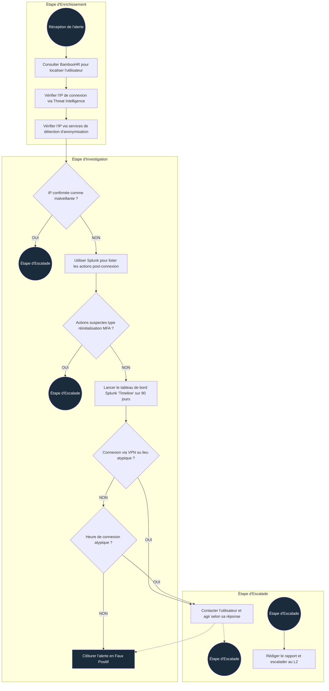

# Introduction

Le tri des alertes (*alert triage*) est un processus complexe qui exige souvent des analystes qu'ils recueillent des informations complémentaires sur les employés ou les serveurs affectés. Ce module explore les *workbooks* du SOC conçus pour rationaliser le tri des alertes et détaille les différentes méthodes de recherche permettant de récupérer rapidement le contexte lié à un utilisateur ou à un système.

## Objectifs pédagogiques

À la fin de ce module, vous serez capable de :

* Vous familiariser avec les guides d'investigation (*workbooks*) du SOC.
* Savoir où trouver et comment utiliser l'inventaire des actifs (*asset inventory*) dans un SOC.
* Comprendre l'importance des diagrammes de réseau d'entreprise.
* Vous exercer à la construction de flux de travail (*workflows*) au sein d'une interface interactive.

---

## Actifs & Identités

Imaginez que vous êtes d'équipe de nuit et que vous examinez une alerte indiquant que l'utilisateur `G.Baker` s'est connecté au serveur `HQ-FINFS-02`. Ensuite, cet utilisateur a téléchargé le fichier *"Financial Report US 2024.xlsx"* depuis ce serveur et l'a partagé avec `R.Lund`.

Pour trier correctement cette alerte et comprendre si cette activité est légitime ou attendue, vous allez devoir répondre à de nombreuses questions :

* Qui est `G.Baker` ? Quels sont ses horaires de travail et son rôle au sein de l'entreprise ?
* Quelle est la fonction du serveur `HQ-FINFS-02` et où est-il situé ? Qui est autorisé à y accéder ?
* Pour quelle raison `R.Lund` aurait-il besoin d'accéder aux registres financiers de l'entreprise ?

### Inventaire des identités (*Identity Inventory*)

L'inventaire des identités est un catalogue référençant les employés de l'entreprise (comptes utilisateurs), les services (comptes de machines/applicatifs) ainsi que leurs détails associés : privilèges, coordonnées et rôles dans l'organisation. Dans notre scénario, cet inventaire vous aiderait à obtenir instantanément le contexte sur `G.Baker` et `R.Lund`, facilitant ainsi la décision de qualifier l'activité de normale ou de suspecte.

#### Sources et solutions d'identité :

| Solution | Exemples | Description |
| --- | --- | --- |
| **Active Directory** | AD On-Premise, Entra ID | L'AD est en soi une base de données d'identités, très largement exploitée par les équipes SOC. |
| **Fournisseurs SSO** | Okta, Google Workspace | Alternative cloud à l'AD, offrant un moyen simple de gérer et de rechercher les utilisateurs. |
| **Systèmes RH** | BambooHR, SAP, HiBob | Limités aux seuls employés, mais fournissent généralement des fiches d'information complètes. |
| **Solutions sur mesure** | Fichiers CSV ou Excel | Il est fréquent que les équipes IT ou sécurité maintiennent leurs propres listes internes. |

### Inventaire des actifs (*Asset Inventory*)

L'inventaire des actifs (ou *asset lookup*) est la liste de toutes les ressources informatiques présentes dans l'environnement IT d'une organisation. Notez que bien que le terme "actif" soit large et puisse englober les logiciels, le matériel ou les employés, ce module se concentre uniquement sur les serveurs et les stations de travail. Dans notre scénario, l'inventaire des actifs vous permettrait de comprendre immédiatement le rôle et la criticité du serveur `HQ-FINFS-02`.

#### Sources et solutions d'actifs :

| Solution | Exemples | Description |
| --- | --- | --- |
| **Active Directory** | AD On-Premise, Entra ID | En plus des identités, l'AD constitue une base de données solide pour répertorier les machines. |
| **SIEM ou EDR** | Elastic, CrowdStrike | Les agents SIEM ou EDR collectent nativement des informations techniques sur les hôtes surveillés. |
| **Solutions MDM** | MS Intune, Jamf MDM | Une catégorie de solutions dédiées à l'inventaire, au déploiement et à la gestion des parcs de machines. |
| **Solutions sur mesure** | Fichiers CSV ou Excel | Tout comme pour les identités, l'utilisation de fichiers personnalisés reste très courante. |

---

## Diagrammes réseau

Pour faire suite aux inventaires d'actifs et d'identités, vous devrez également analyser l'alerte sous l'angle du réseau, en particulier dans les grandes infrastructures. Prenons un scénario où vous enquêtez sur une chaîne d'alertes corrélées basées sur les journaux de pare-feu (*firewall logs*). Vous cherchez à donner du sens aux adresses IP détectées :

* **08:00 :** L'IP `103.61.240.174` se connecte de manière répétée au pare-feu de l'entreprise via le port `TCP/10443`.
* **08:23 :** Les logs du pare-feu indiquent que l'IP externe `103.61.240.174` a été traduite (NAT) en une IP interne : `10.10.0.53`.
* **08:25 :** L'IP `10.10.0.53` scanne la plage réseau `172.16.15.0/24` mais ne trouve aucun port ouvert.
* **08:32 :** Cette même IP scanne à présent la plage réseau `172.16.23.0/24`. L'attaque semble être en cours.

### Utilité du diagramme réseau

Pour mener à bien cette enquête, vous devez découvrir quel service est hébergé sur le port `10443`, identifier le sous-réseau (*subnet*) auquel appartient l'IP `10.10.0.53`, et comprendre pourquoi elle tente de communiquer avec d'autres zones du réseau.

Un diagramme réseau — une cartographie visuelle présentant les différents sites, les sous-réseaux et leurs interconnexions — apporte la réponse à vos questions :

```text
 [ Internet ] ──► [ IP: 103.61.240.174 ]
                        │
                        ▼  (Port TCP/10443)
              ┌──────────────────┐
              │ Pare-feu / VPN   │ ──► Nom DNS: vpn.tryhackme.thm
              └──────────────────┘
                        │
                        ▼  (NAT: 10.10.0.53)
               [ Sous-réseau VPN ] (10.10.0.0/24)
                        │
         ┌──────────────┴──────────────┐
         ▼                             ▼
 [ Sous-réseau Base de Données ]     [ Sous-réseau Bureaux ]
       (172.16.15.0/24)                    (172.16.23.0/24)
  [Flux Bloqué par le Pare-feu]        [Cible Actuelle du Scan]

```

Selon la taille et la structure de l'entreprise, vous ferez face à des schémas bien plus complexes, mais leur utilité pour l'analyste SOC reste identique : aider à interpréter une activité réseau suspecte. Dans notre scénario, le diagramme réseau vous permet de reconstruire précisément le chemin de l'attaque :

1. L'attaquant derrière l'IP `103.61.240.174` a mené une attaque par force brute sur le service VPN, en ciblant `vpn.tryhackme.thm`.
2. Après avoir réussi à forcer l'accès et à se connecter au VPN, l'attaquant s'est vu attribuer une adresse IP interne appartenant au sous-réseau VPN (`10.10.0.53`).
3. L'adversaire a ensuite tenté de scanner le sous-réseau des Bases de Données, mais a probablement été bloqué par les règles de filtrage du pare-feu.
4. Constatant cet échec, l'attaquant s'est réorienté vers le sous-réseau des Bureaux, à la recherche de sa prochaine cible.

---

## Théorie des Workbooks

Disposer des inventaires d'actifs et des diagrammes réseau vous donne le contexte nécessaire sur l'utilisateur, la machine ou l'adresse IP. L'étape suivante consiste à déterminer si l'activité observée est légitime ou malveillante. Si l'analyse est évidente pour certaines alertes, d'autres exigent le respect scrupuleux de dizaines d'étapes essentielles pour éviter de passer à côté d'une preuve critique.

Comment s'assurer que toutes les étapes d'analyse sont systématiquement suivies ?

### Les Workbooks du SOC

Un **Workbook SOC** (également appelé *playbook*, *runbook* ou *workflow*) est un document structuré qui définit les étapes requises pour enquêter sur des menaces spécifiques et y remédier de manière efficace et uniforme. Les analystes L1 étant des profils juniors, ils ne sont pas censés maîtriser parfaitement chaque scénario d'attaque. Les analystes seniors préparent donc ces guides pour encadrer leurs équipes. Il est fortement recommandé (et souvent obligatoire) que le L1 suive précisément le workbook pour éviter les erreurs et optimiser le temps d'analyse.

#### Exemple de Workbook (Alerte de connexion suspecte)



Le diagramme ci-dessus est un exemple typique de workbook d'investigation conçu pour guider un analyste L1 lors du tri d'une alerte liée à une connexion atypique (qu'il s'agisse d'une messagerie, d'un accès web ou d'un VPN d'entreprise).

Dans la pratique, ces logigrammes sont accompagnés d'un guide textuel détaillé et de liens vers les outils mentionnés. Remarquez la division du workbook en trois phases logiques distinctes. Suivre cet ordre précis garantit un tri de haute qualité et élimine le risque de rendre un verdict hâtif sans preuves suffisantes :

1. **Enrichissement (*Enrichment*) :** Utiliser la *Threat Intelligence* et l'inventaire des identités pour collecter toutes les données disponibles sur l'utilisateur concerné.
2. **Investigation :** Exploiter les données récoltées et les logs du SIEM pour déterminer si la connexion correspond à un comportement normal ou attendu.
3. **Escalade (*Escalation*) :** Transmettre l'alerte au niveau L2 ou interroger directement l'utilisateur sur sa connexion si la situation l'exige.
